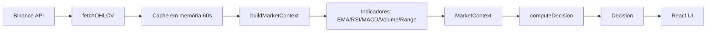

# Arquitetura — Overview

## Fluxo macro

## Camadas

- `app/api/*`: entrada HTTP.
- `lib/services/*`: orquestração do contexto.
- `lib/indicators/*`: funções puras de cálculo.
- `lib/decision.ts`: score + sinal final.
- `app/components/*`: visualização e interação.

## Decisão de stack

- Next.js fullstack: API routes + UI no mesmo projeto.
- Cache em memória: reduz carga sem precisar Redis.
